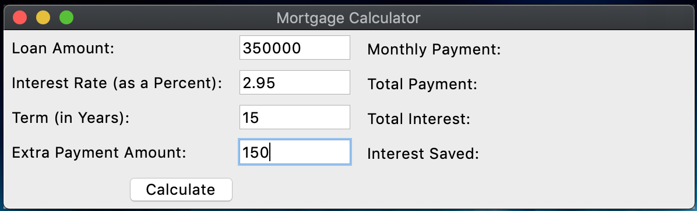
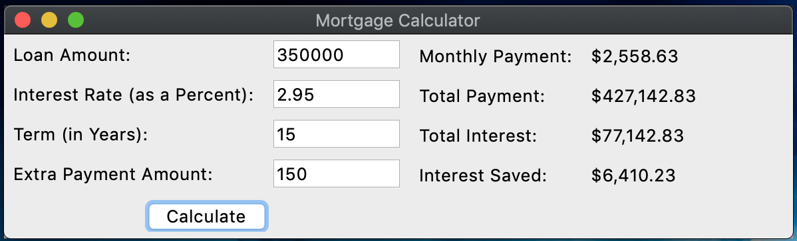

# Mortgage-Calculator-GUI
A simple mortgage calculator with a GUI

## About this project

## Project Learning Goals

After completing the mortgage calculator without a GUI, this project was meant to familiarize myself with creating GUIs.

- Understand basic concepts of designing a GUI layout with various forms of input from the user and output from the program
- Learn the fundamental tools of the TKinter Package such as widgets and windows, geometry management, and event handling

## About the Code

This version of the mortgage calculator has many more lines of code than the version without the GUI, but isn’t much more complicated. There is one function definition that is called when the user presses the "Calculate" button in the GUI. There’s still no version specified or error handling, but I still achieved my learning goals and made progress toward becoming a more competent programmer. 

## Running the Program

Running the program requires navigating to the correct directory in the terminal launching the program with the `python` or `python3` command, depedning on how your environment is set up. Upon launch, a GUI window pops up with areas for text input from the user and output from the program and a "Calculate" button.

As an example, we can consider a $350,000 mortgage at 2.95% interest with a term of 15 years. We will be making 1 payment a month with an additional $150 added to each payment. We input the information into the GUI in the appropriate fields.

Finally, clicking the "Calculate" button runs the computations and displays the results.

## How to Improve

Probably the best thing I can do to improve my coding skills moving forward is getting feedback from knowledgeable people. Without external feedback, I don’t really know if my code is good or bad, and I don’t really know the best places to focus my efforts. Other than that, here are a few other areas I could improve the program.

- Output a CSV file using the csv package in the Python Standard Library instead of a messy text file
- Use the Matplotlib package to create charts and graphs from the calculated data to better organize the information for the user
