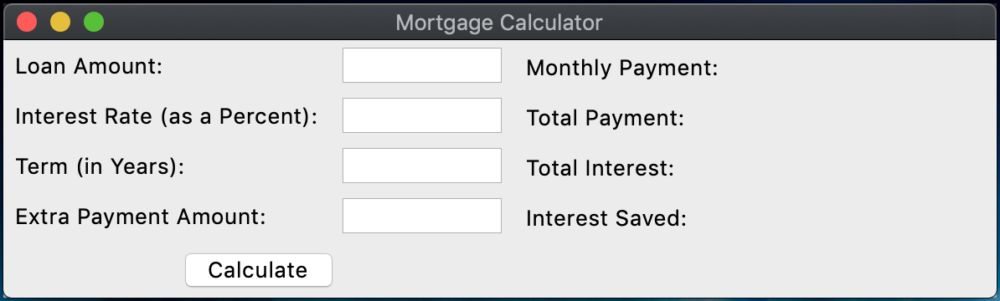

# Mortgage-Calculator-GUI
A simple mortgage calculator with a GUI

## About this project

## Project Learning Goals

After completing the mortgage calculator without a GUI, this project was meant to familiarize myself with creating GUIs.

- Understand basic concepts of designing a GUI layout with various forms of input from the user and output from the program
- Learn the fundamental tools of the TKinter Package such as widgets and windows, geometry management, and event handling

## Running the Program

Running the program requires navigating to the correct directory in the terminal launching the program with the `python` or `python3` command, depedning on how your environment is set up. Upon launch, a GUI window pops up with areas for text input from the user and output from the program and a "Calculate" button.

  
